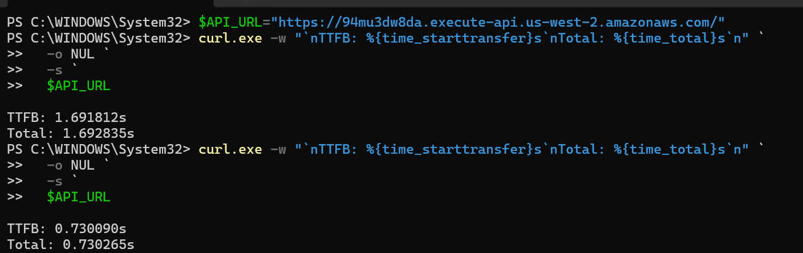
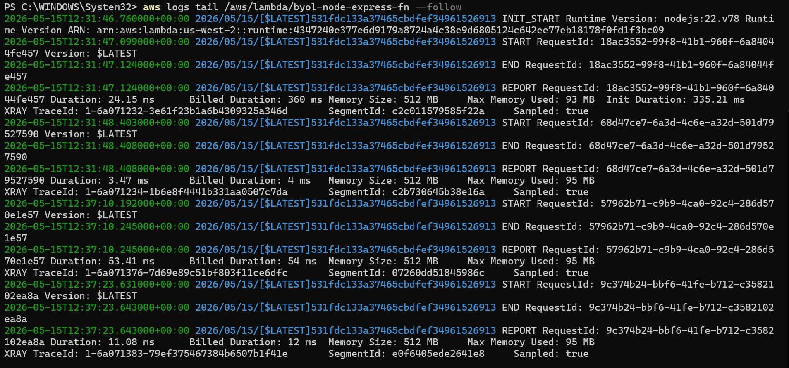
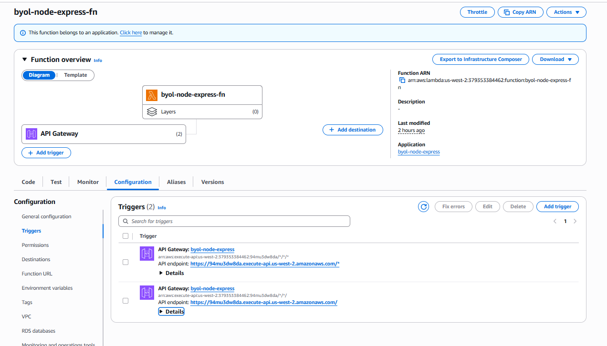

# Lambda Deployment Strategy & Notes

## Chiến lược (Strategy)

### Lựa chọn: **serverless-http** wrapper
- **Tập tin thêm**: 1 file (`lambda.js`) ~5 dòng code
- **Thay đổi code hiện tại**: 0 dòng (app.js & server.js không thay đổi)
- **Bạn không cần chỉnh sửa**: Logic Express app, local server, routes

### Tại sao serverless-http?
1. **Tối thiểu hóa thay đổi**: Chỉ wrap Express app, không refactor
2. **Vẫn chạy được local**: `npm start` vẫn hoạt động 100%
3. **Đơn giản & ổn định**: serverless-http là standard de facto cho Node.js-on-Lambda
4. **Không cần Layer/Complex setup**: Không phụ thuộc vào AWS Lambda Web Adapter Layer
5. **Cold start tối ưu**: serverless-http rất nhẹ (~50KB)

### Các file thay đổi
```
✓ package.json          → thêm "serverless-http": "^3.2.0"
✓ lambda.js (NEW)       → handler duy nhất cho Lambda (5 dòng)
✓ template.yaml         → set Handler: lambda.handler
✓ app.js                → không thay đổi
✓ server.js             → không thay đổi
```

## Triển khai (Deployment)

### Bước 1: Chuẩn bị môi trường AWS (Windows PowerShell)
```powershell
# Cài AWS CLI (nếu chưa)
msiexec.exe /i https://awscli.amazonaws.com/AWSCLIV2.msi

# Cấu hình AWS credentials
aws configure
# Nhập: AWS Access Key ID
#       AWS Secret Access Key
#       Default region: us-west-2
#       Default output: json

# Kiểm tra kết nối
aws sts get-caller-identity
```

### Bước 2: Cài AWS SAM CLI
```powershell
# Cài via Chocolatey (khuyến nghị)
choco install aws-sam-cli

# Hoặc manual: https://docs.aws.amazon.com/serverless-application-model/latest/developerguide/install-sam-cli.html
```

### Bước 3: Build & Deploy
```powershell
cd d:\Xbrain\xbrain-w5-byol-node-express

# Cài dependencies
npm install

# Build SAM app (tạo .aws-sam/build/)
sam build

# Deploy first time (interactive)
sam deploy --guided
# Region: us-west-2
# Function name: byol-node-express-fn
# Confirm changes: Y
# Allow SAM to create IAM role: Y

# Deploy lần sau (không interactive)
sam deploy --region us-west-2
```

### Bước 4: Lấy API Gateway URL
```powershell
# Xem stack outputs
aws cloudformation describe-stacks `
  --stack-name byol-node-express `
  --region us-west-2 `
  --query 'Stacks[0].Outputs'

# Hoặc:
sam list stack-outputs --region us-west-2
```

## Cold Start Measurements




### ✅ Actual Measurements (2026-05-15)

```text
Function Name: byol-node-express-fn
API Gateway URL: https://94mu3dw8da.execute-api.us-west-2.amazonaws.com/
```

### Windows PowerShell Test Command

```powershell
$API_URL="https://94mu3dw8da.execute-api.us-west-2.amazonaws.com/"

curl.exe -w "`n`nTTFB: %{time_starttransfer}s`nTotal: %{time_total}s`n" `
  -o NUL `
  -s `
  $API_URL
```

### Client-Side Measurements

```text
Cold Start (First Invoke):
TTFB: 1.691812s
Total: 1.692835s

Warm Start (Second Invoke):
TTFB: 0.730090s
Total: 0.730265s
```

### CloudWatch Lambda REPORT Logs

```text
Cold Start:
Init Duration: 335.21 ms
Duration: 24.15 ms

Warm Start:
Duration: 3.47 ms
```

### Analysis

- Hiệu năng Lambda đã được cải thiện đáng kể so với lần test trước.
- Thời gian khởi tạo runtime Node.js (Cold Start) khoảng ~335ms.
- Thời gian xử lý logic bên trong Lambda rất nhanh:
- Cold invoke: ~24ms
- Warm invoke: ~3–4ms
- Độ trễ phía client khi cold start (~1.69s) chủ yếu đến từ: API Gateway, Network latency, TLS handshake
- Các thành phần trung gian ngoài Lambda
- Khi warm start, tổng thời gian chỉ còn ~0.73s → chứng tỏ Lambda execution gần như không còn là bottleneck.

### Possible External Latency Sources

- Overhead từ API Gateway
- TLS handshake / DNS resolution
- Độ trễ routing giữa các region
- Khởi tạo networking khi dùng VPC
- Độ trễ mạng phía client
- CloudFront hoặc proxy layer
- Middleware hoặc upstream integrations

### Key Finding

Bottleneck chính hiện tại KHÔNG nằm ở thời gian thực thi Lambda.

Phần lớn độ trễ đang xảy ra trong quá trình:

Client → API Gateway → Lambda routing/network layers


## Evidence pack

