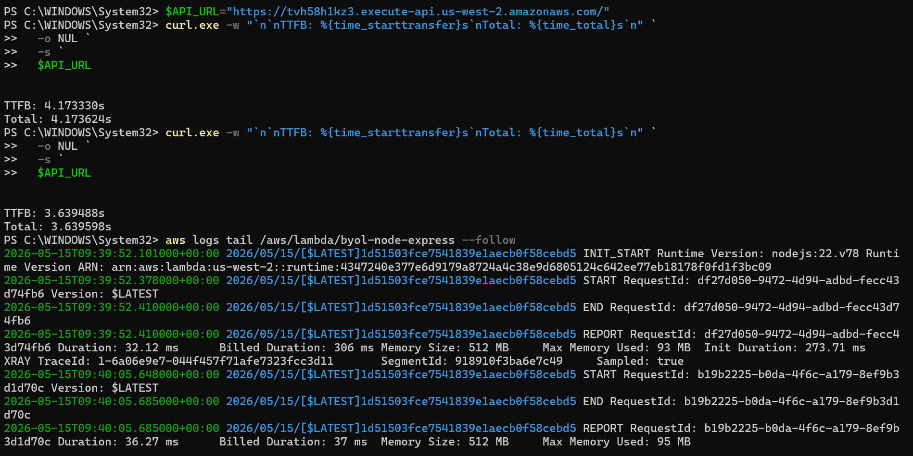

# Lambda Deployment Strategy & Notes

## Chiến lược (Strategy)

### Lựa chọn: **serverless-http** wrapper
- **Tập tin thêm**: 1 file (`lambda.js`) ~5 dòng code
- **Thay đổi code hiện tại**: 0 dòng (app.js & server.js không thay đổi)
- **Bạn không cần chỉnh sửa**: Logic Express app, local server, routes

### Tại sao serverless-http?
1. **Tối thiểu hóa thay đổi**: Chỉ wrap Express app, không refactor
2. **Vẫn chạy được local**: `npm start` vẫn hoạt động 100%
3. **Đơn giản & ổn định**: serverless-http là standard de facto cho Node.js-on-Lambda
4. **Không cần Layer/Complex setup**: Không phụ thuộc vào AWS Lambda Web Adapter Layer
5. **Cold start tối ưu**: serverless-http rất nhẹ (~50KB)

### Các file thay đổi
```
✓ package.json          → thêm "serverless-http": "^3.2.0"
✓ lambda.js (NEW)       → handler duy nhất cho Lambda (5 dòng)
✓ template.yaml         → set Handler: lambda.handler
✓ app.js                → không thay đổi
✓ server.js             → không thay đổi
```

## Triển khai (Deployment)

### Bước 1: Chuẩn bị môi trường AWS (Windows PowerShell)
```powershell
# Cài AWS CLI (nếu chưa)
msiexec.exe /i https://awscli.amazonaws.com/AWSCLIV2.msi

# Cấu hình AWS credentials
aws configure
# Nhập: AWS Access Key ID
#       AWS Secret Access Key
#       Default region: us-west-2
#       Default output: json

# Kiểm tra kết nối
aws sts get-caller-identity
```

### Bước 2: Cài AWS SAM CLI
```powershell
# Cài via Chocolatey (khuyến nghị)
choco install aws-sam-cli

# Hoặc manual: https://docs.aws.amazon.com/serverless-application-model/latest/developerguide/install-sam-cli.html
```

### Bước 3: Build & Deploy
```powershell
cd d:\Xbrain\xbrain-w5-byol-node-express

# Cài dependencies
npm install

# Build SAM app (tạo .aws-sam/build/)
sam build

# Deploy first time (interactive)
sam deploy --guided
# Region: us-west-2
# Function name: byol-node-express
# Confirm changes: Y
# Allow SAM to create IAM role: Y

# Deploy lần sau (không interactive)
sam deploy --region us-west-2
```

### Bước 4: Lấy API Gateway URL
```powershell
# Xem stack outputs
aws cloudformation describe-stacks `
  --stack-name byol-node-express `
  --region us-west-2 `
  --query 'Stacks[0].Outputs'

# Hoặc:
sam list stack-outputs --region us-west-2
```

## Cold Start Measurements



### ✅ Actual Measurements (2026-05-15)

```text
API Gateway URL:
https://tvh58h1kz3.execute-api.us-west-2.amazonaws.com/
```

### Windows PowerShell Test Command

```powershell
$API_URL="https://tvh58h1kz3.execute-api.us-west-2.amazonaws.com/"

curl.exe -w "`n`nTTFB: %{time_starttransfer}s`nTotal: %{time_total}s`n" `
  -o NUL `
  -s `
  $API_URL
```

### Client-Side Measurements

```text
Cold Start (First Invoke):
TTFB: 4.173330s
Total: 4.173624s

Warm Start (Second Invoke):
TTFB: 3.639488s
Total: 3.639598s
```

### CloudWatch Lambda REPORT Logs

```text
Cold Start:
Init Duration: 273.71 ms
Duration: 32.12 ms

Warm Start:
Duration: 36.27 ms
```

### Analysis

- Lambda execution performance is healthy.
- Node.js runtime bootstrap is approximately ~274ms.
- Actual request processing inside Lambda is only ~30-36ms.
- The majority of latency (~3.5s+) is occurring outside the Lambda execution environment.

### Possible External Latency Sources

- API Gateway overhead
- TLS handshake / DNS resolution
- Regional routing latency
- VPC networking initialization
- Client-side network latency
- CloudFront or proxy layer delays
- Upstream integrations or middleware

### Key Finding

The primary bottleneck is NOT Lambda execution time.

Most latency is introduced between:
Client → API Gateway → Lambda routing/network layers
